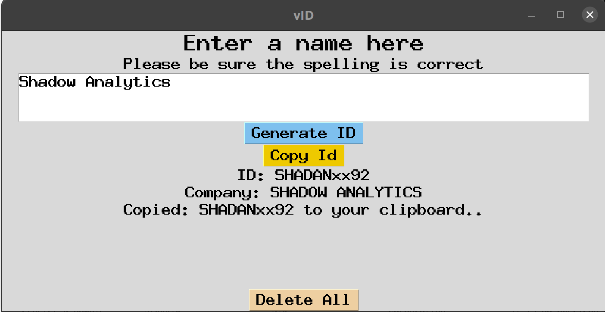
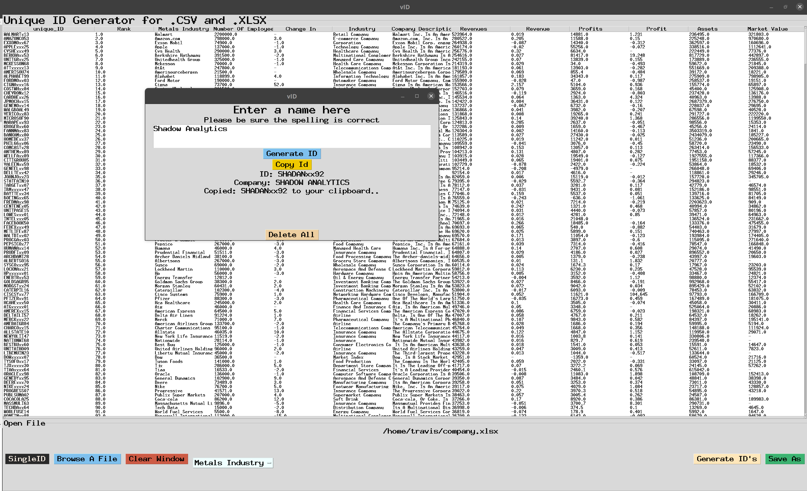

# Welcome to vID

## Summary

vID is a string slicing tool that slices the words in a name-string,
concatonates the sub-strings, hashes the unique sub-strings,
and concatonates a few numbers generated from the sub-strings unique hash.
If you enter a string the same way each time, it will return the same unique id. 
If a string does not contain enough sub-strings to satisfy the conditions, placeholder 'x' is used.

vID backend is all python/pandas and the GUI is [tkinter](https://docs.python.org/3/library/tk.html)

## vID will soon be a stand alone a desktop app, currently building the .exe

## vID makes it easy to read a csv or xlix file and convert an entire column of name values to unique id's. 

<ol>
<li>Click "Browse A File" to open a file explorer</li>
<li>Select the .csv or .xlix file that contains the name column for which you want to generate ID's </li>
<li>Once you've selected a file, a new button "Select Column Name" appears.</li>
<li>Click the "Select Column Name" button and select the column name for which you want to generate ID's</li>
<li>Next, click "Generate ID's" and your new "UniqueID's" column will automagically append itself to the first position in your files column index.</li>
<li>To Save As, click the "Save As" button then designate a filename and location in which to save your file. </li>
</ol>

## FOr a single ID:

<ol>
<li>The "SingleID" button opens a dialog box that askes you to input a name.</li>
<li>Enter the name you want to generate a unique ID for then press "Generate ID"</li>
<li>The name and new ID will be displayed below the textbox</li>
<li>Push "Copy ID" to copy the new ID to your clipboard</li>
<li>"Delete All" clears all fields so you can run another name</li>
</ol>

## The desktop name converter:

## Installation

Details coming soon, still configuring the .exe, for now you'll have to have a pyhton environment to use this tool.

## Summary
### vID:
<ol>
<li>Converts inputs to uppercase</li>
<li>Removes all "stop words", non alpha, and  non numeric characters </li>
<li>Counts the letters in the name</li>
<li>Counts the words in the name</li>
<li>slices the name according to the following convention: </li>
<ol>
<li>If the name is one word, it takes the first 8 characters in the name.</li>
<li>If the name has >=2 words: </li>
<ol>
<li>Grabs the first four characters in the first word of the name, or any characters present in that range(<= 4 characters).</li>
<li>After slicing the first word it passes to the next word and takes the first two characters or whatever is present <= 2 characters</li>
<li> If another word exists it will slice the first two characters present or whatever is present <= 2 characters</li>
<li>It repeats this process until it slices a total of 8 characters</li>
</ol>
</ol>
<li>After 8 characters have been sliced they are passed as a key to a hashing function which returns their hash value</li>
<li>The 2nd to the 4th hash values are concatonated onto the 8 character unique string id:</li>
<li>If the name was <=7 characters either before or after slicing, a lowercase placeholder value was added for readability</li>
<ol>
<li>In this instance I chose "x" as a placeholder but that can be easily changed in the script</li>
<ol>
</ol>

