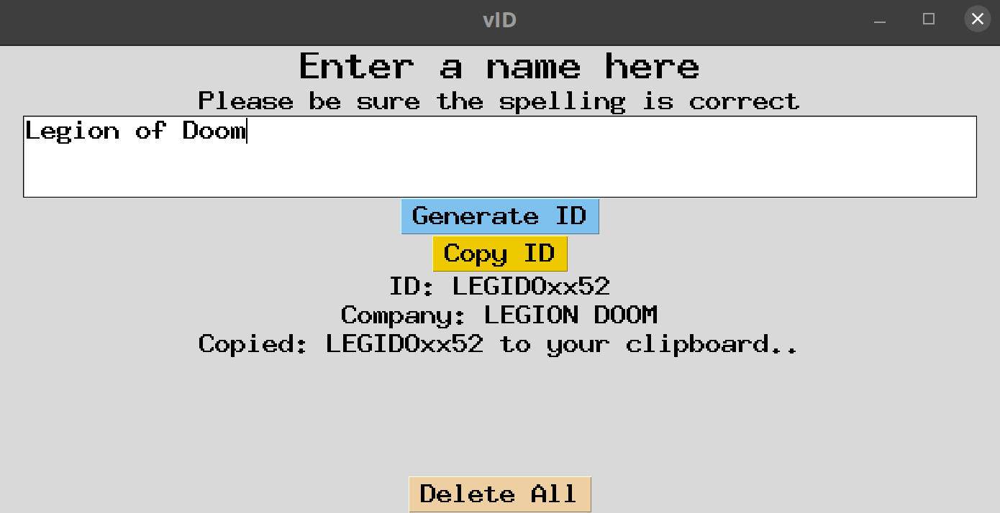

# Welcome to vID

## Summary

<p>
vID is a string slicing tool that slices the words in a name-string,
concatonates the sub-strings, hashes the unique sub-strings,
and concatonates a few numbers generated from the sub-strings unique hash.
If you enter a string the same way each time, it will return the same unique id. 
If a string does not contain enough sub-strings to satisfy the conditions, placeholder 'x' is used.
</p>


## vID comes as a .exe/desktop app. 


## vID makes it easy to read a csv or xlix file and convert an entire column of name values to unique id's. 

<ol>
<li>Click "Browse A File" to open a file explorer</li>
<li>Select the .csv or .xlix file that contains the name column for which you want to generate ID's </li>
<li>Once you've selected a file, a new button "Select Column Name" appears.</li>
<li>Click the "Select Column Name" button and select the column name for which you want to generate ID's</li>
<li>Next, click "Generate ID's" and your new "UniqueID's" column will automagically append itself to the first position in your files column index.</li>
<li>To Save As, click the "Save As" button then desigante a filename and location in which to save your file. </li>
</ol>

## FOr a single ID:

<ol>
<li>The "SingleID" button opens a dialog box that askes you to input a name.</li>
<li>Enter the name you want to generate a unique ID for then press "Generate ID"</li>
<li>The name and new ID will be displayed below the textbox</li>
<li>Push "Copy ID" to copy the new ID to your clipboard</li>
<li>"Delete All" clears all fields so you can run another name</li>
</ol>

## The desktop name converter:


## Installation

<p>
Details coming soon, still configuring the .exe, for now you'll have to have a pyhton environment to use this tool.

</p>

## Summary
### vID:
<ol>
<li>Converts inputs to uppercase</li>
<li>Removes all non alpha or numeric characters </li>
<li>Counts the letters in the name</li>
<li>Counts the words in the name</li>
<li>slices the name according to the following convention: </li>
<ol>
<li>If the name is one word, it takes the first 8 characters in the name.</li>
<li>If the name has >=2 words: </li>
<ol>
<li>Grabs the first four characters in the first word of the name, or any characters present in that range(<= 4 characters).</li>
<li>After slicing the first word it passes to the next word and takes the first two characters or whatever is present <= 2 characters</li>
<li> If another word exists it will slice the first two characters present or whatever is present <= 2 characters</li>
<li>It repeats this process until it slices a total of 8 characters</li>
</ol>
</ol>
<li>After 8 characters have been sliced they are passed as a key to a hashing function which returns their hash value</li>
<li>The 2nd to the 4th hash values are concatonated onto the 8 character unique string id:</li>
<li>If the name was <=7 characters either before or after slicing, a lowercase placeholder value was added for readability</li>
<ol>
<li>In this instance I chose "x" as a placeholder but that can be easily changed in the script</li>
<ol>
</ol>

### To change the placeholder update the code below. Replace the 'x' in " unique_key += 'x' " with the character you want as your placeholder.
### The code is on line 30 in the "id_4_csv.ipynb" file.

### It looks like this:
```python
    if len(unique_key) <= 8:
        unique_key += 'x' * (8 - len(unique_key))
```

## To use the csv parser you must make a few changes to this code to declare the path and name of your file, and the name of your column.


### The best thing to do is rename your file to "company.xlsx" and move it to the "csv_parser" folder, otherwise follow the steps below

### You must change the name of the "read_excel('company.csv')" to the filepath and/or name of your excel file

### You mush also change some code in this file to point at the column you have that contains your names.

### Cell 4, line 5: "keys_list.append(generate_unique_id(row[" 'Your name column's name here'  "]))" is the location of that command


###  Change the code below to point at your names column:

```python
        keys_list.append(generate_unique_id(row[" <Your name column's name here>  "]))
```
### After youve updated the name column name you can run the cells and generate unique Ids for every value in your names column.
